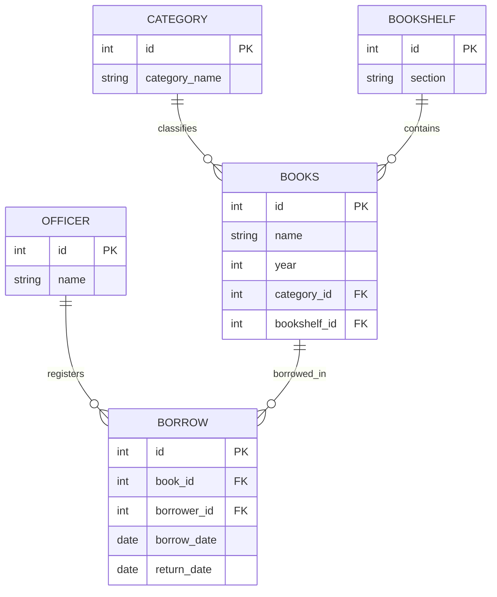

# Library System

```mermaid
erDiagram

BOOKS {
    int id PK
    string name
    int year
    int category_id FK
    int bookshelf_id FK
}

CATEGORY {
    int id PK
    string category_name
}

BOOKSHELF {
    int id PK
    string section
}

OFFICER {
    int id PK
    string name
}


BORROW {
    int id PK
    int book_id FK
    int borrower_id FK
    date borrow_date
    date return_date
}

CATEGORY ||--o{ BOOKS : classifies
BOOKSHELF ||--o{ BOOKS : contains
OFFICER ||--o{ BORROW : registers
BOOKS ||--o{ BORROW : borrowed_in

```
